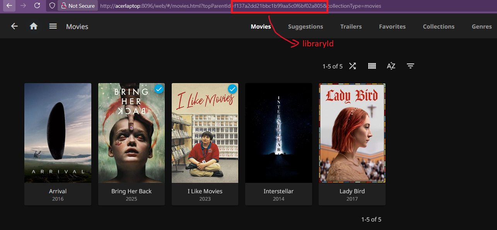

Things that work:
* Logging into the server
* Displaying the movies in the server
* Logging out of the server

Things that don't work:
* Literally everything else

To interested developers:
If you're facing issues logging into your server, make sure there aren't any slashes in the host field after your port number. Your host field should look something like this: "http://localhost:8096".

Postman tool was helpful to me in understanding Jellyfin's API. I've hardcoded the LibraryID string in MoviePage.xaml.cs. You will need to change its value for your movie library in order for movie fetching to work. You can find the libraryId in the URL of your movies page in jellyfin web.

Alternatively, you can write logic to automatically fetch this value.

Screenshots:
